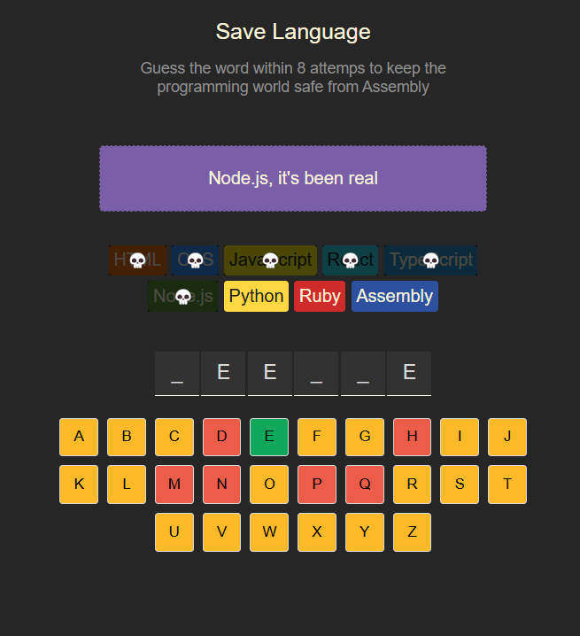

# SaveLngGame

🎮 A fun, interactive word-guessing game built with React!

SaveLngGame challenges players to guess letters of a hidden word one-by-one. It's a test of logic, vocabulary, and strategy. Just like Hangman – but built modern using React and JavaScript.

---

## 🧠 How to Play

- A hidden word is chosen randomly.
- You guess the word one letter at a time.
- Correct letters are revealed in their correct positions.
- Incorrect guesses may be tracked.
- The game ends when:
  - All letters are guessed (**Win!**)
  - You run out of allowed wrong guesses (**Game Over!**)
- Restart the Game

---

## 🖼️ Preview

> _Add a screenshot or GIF of the game here_

---

## 🛠️ Features

- ✅ React-based frontend
- ✅ Interactive key input to guess letters
- ✅ Visual feedback for correct & wrong guesses
- ✅ Stylized UI showing letter reveals
- ✅ Easily extendable word list and logic

---

## 📦 Tech Stack

- **React** — Frontend framework
- **JavaScript / JSX** — Application logic
- **HTML + CSS** — Layout & styling

---

## ✅ Getting Started

### 1. Clone the Repo

```
git clone https://github.com/mycode-name/SaveLngGame.git
cd SaveLngGame
```

### 2. Install Dependencies

```
npm install
```

### 3. Start the Development Server

```
npm start
```

This runs the app in development mode. Visit [http://localhost:5173](http://localhost:5173) to play locally.


---

## 🙌 Acknowledgements

- React Docs
- Open source word lists
- Inspiration from Hangman / Wordle

---
